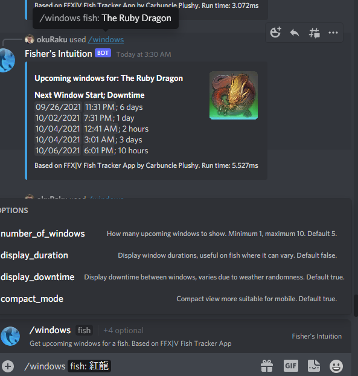
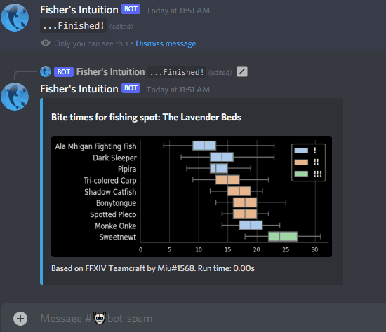

# Fisher's Intuition
This Discord bot acts as a front end to other apps (publishing Soon&trade;), providing information useful to Fishers in the critically acclaimed MMORPG Final Fantasy XIV.

## `/windows`

On a server that the commands have been registered and the bot added, start by simply typing `/windows`.  Five parameters are currently offered, though only fish is required.
Server component borrows heavily from [FFX|V Fish Tracker App](https://github.com/icykoneko/ff14-fish-tracker-app).

**fish**: String.  Required.  Desired fish, any language.
```
/windows fish:Cupfish
```

**number_of_windows**: Number. Optional.  How many upcoming windows to show.  Minimum 1, maximum 10.  Default 5.


```
/windows fish:Cupfish number_of_windows:1
```

**display_duration**:  Boolean. Optional.  Display window durations, useful on fish where it can vary, like Celestial.  Default false. 


```
/windows fish:Cupfish display_duration:True
```

**display_downtime**:  Boolean. Optional.  Display downtime between windows, varies due to weather randomness.  Default true.


```
/windows fish:Cupfish display_downtime:True
```

**compact_mode**:  Boolean. Optional.  Compact view more suitable for mobile. Default true.

```
/windows fish:Cupfish compact_mode:True
```



## `/bitetimes`

This command does not require any parameters, instead displaying a selection menu to the user.  Server component pulls data from [FFXIV Teamcraft](https://github.com/ffxiv-teamcraft/ffxiv-teamcraft) to generate charts of bite times of fish by fishing spot.  Optionally, plotType can be specified if desired.




*FINAL FANTASY is a registered trademark of Square Enix Holdings Co., Ltd.
FINAL FANTASY XIV © 2010 - 2021 SQUARE ENIX CO., LTD. All Rights Reserved.*
